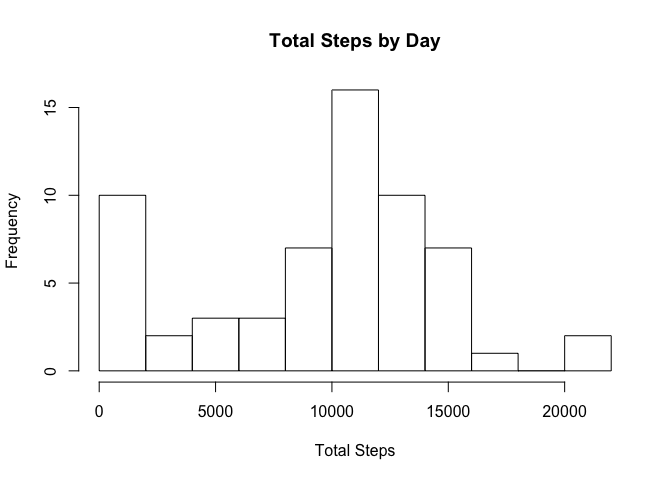
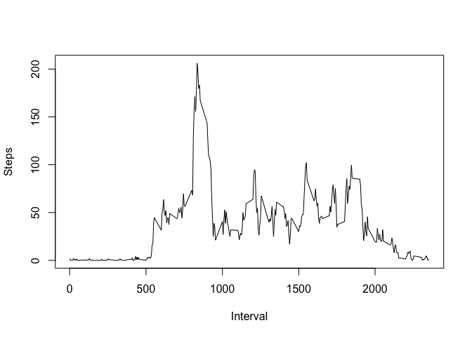
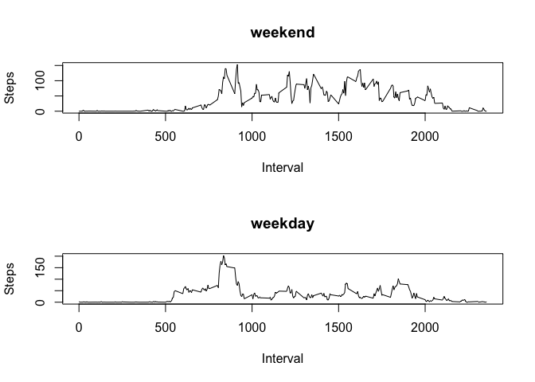

# Reproducible Research: Peer Assessment 1


## Loading and preprocessing the data

Input file: activity.csv

Description: counts steps taken, in 5-minute intervals

Data source: Reproducible Research course


```r
step <- read.csv("activity.csv")
```


## What is mean total number of steps taken per day?

- histogram of total number of steps by day
- report median and mean


```r
library(plyr)
daystep <- aggregate(step$steps, list(step$date), sum, na.rm=TRUE)
colnames(daystep) <- c("Date", "Steps")
hist(daystep$Steps, breaks=9,
     main="Total Steps by Day",
     xlab="Total Steps")
```

 

```r
steps.day.median <- median(daystep$Steps)
steps.day.mean <- mean(daystep$Steps)
```

Median total steps per day: 10395

Mean total steps per day: 9354.2295082


## What is the average daily activity pattern?

- time series plot of steps by time of day
- interval containing peak activity


```r
intstep <- aggregate(step$steps, by=list(step$interval), mean,
                     na.rm=TRUE)
colnames(intstep) <- c("Interval", "Steps")
plot(intstep, type = "l")
```

 

```r
peak.i <- which.max(intstep$Steps)
peak.int <- intstep$Interval[peak.i]
```

Interval 835 has the greatest number of steps.


## Imputing missing values

- count NAs
- replace NA
- redo steps per day


```r
step.count.na <- sum(is.na(step$steps))

# replace NA sequentially with previous value or 0
impstep <- step
replacena <- 0L
for (i in 1:nrow(impstep)) {
     if (is.na(impstep$steps[i])) impstep$steps[i] <- replacena
     else replacena <- impstep$steps[i]
}
 
# steps per day
daystep.imp <- aggregate(impstep$steps, list(impstep$date), 
                         sum, na.rm=TRUE)
colnames(daystep.imp) <- c("Date", "Steps")
hist(daystep.imp$Steps, breaks=9,
     main="Total Steps by Day",
     xlab="Total Steps")
```

 

```r
steps.day.median.imp <- median(daystep.imp$Steps)
steps.day.mean.imp <- mean(daystep.imp$Steps)
```

Median total steps per day (after replacing missing values): 
10395

Mean total steps per day (after replacing missing values): 
9354.2295082

Mean total steps per day is 
unchanged as a result of replacing
missing values with preceding values. 
Median is also unchanged.

## Are there differences in activity patterns between weekdays and weekends?


- identify weekend
- panel plot


```r
weekday <- weekdays(as.POSIXlt(as.character(impstep$date)),
                    abbreviate=TRUE) %in%
     c("Mon", "Tue", "Wed", "Thu", "Fri")
impstep$weekpart <- as.factor(ifelse(weekday, "weekday", "weekend"))

comp <- aggregate(impstep$steps, 
                  list(impstep$interval, impstep$weekpart), mean)
colnames(comp) <- c("Interval", "Weekpart", "Steps")


par(mfrow = c(2, 1))
plot(comp$Interval[comp$Weekpart == "weekend"],
     comp$Steps[comp$Weekpart == "weekend"], type="l",
     main="weekend", xlab="Interval", ylab="Steps")
plot(comp$Interval[comp$Weekpart == "weekday"],
     comp$Steps[comp$Weekpart == "weekday"], type="l",
     main="weekday", xlab="Interval", ylab="Steps")
```

 

```r
par(mfrow = c(1, 1))
```
